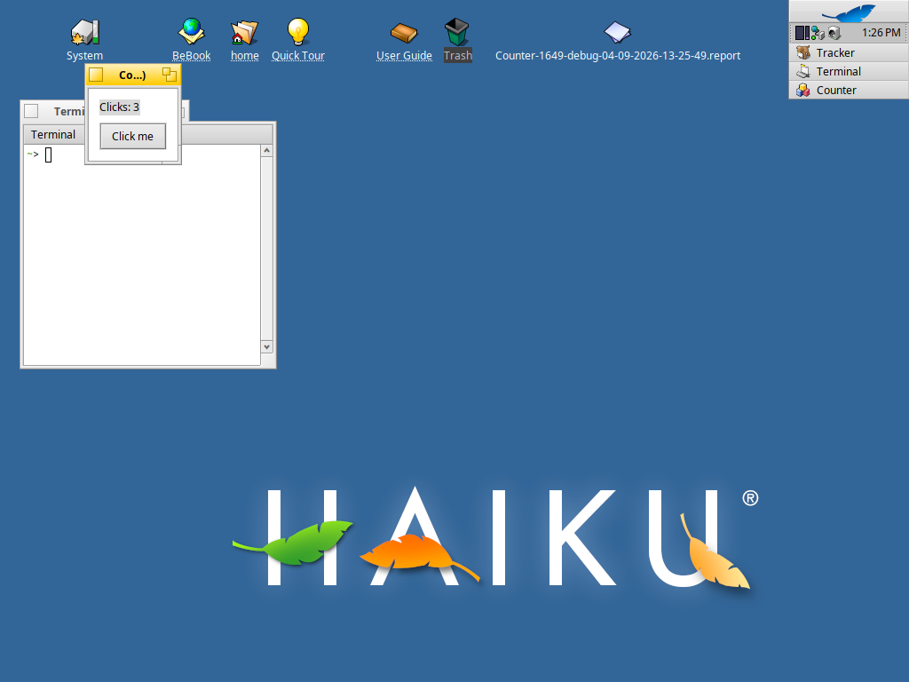
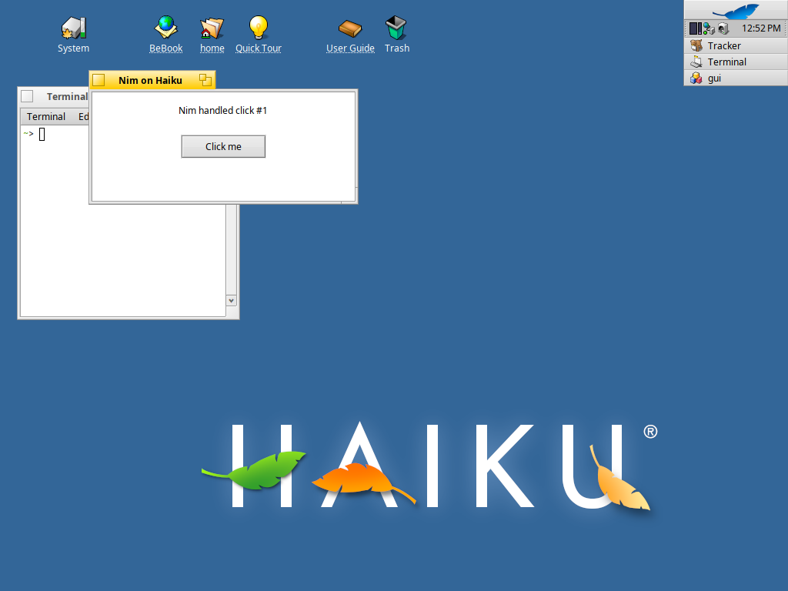

# Nim for Haiku

Write native [Haiku](https://www.haiku-os.org/) GUI applications in
[Nim](https://nim-lang.org/) instead of C++. Your app code is pure Nim; a small,
reusable C++ shim bridges to Haiku's native API.



The app above is `src/app.nim` — about 15 lines of Nim, packaged as a native
`.hpkg` and shown in the Deskbar. No C++ in the app itself.

## Why this exists

Haiku's application framework (the BeAPI) is C++, and its GUI model is built on
subclassing: you extend `BWindow` or `BView` and override virtual methods. Nim's
C++ backend can *call* the BeAPI directly, but it can't emit a native C++
subclass with overridden virtuals — that one gap is the whole reason a C++ layer
is needed at all.

The answer is a thin, generic shim that subclasses the BeAPI once and forwards
every event to a Nim callback. You write Nim; the shim is fixed library
plumbing you never touch. This is the same shape every high-level language uses
to bind a C++ framework.

## How it works

The click path shows both directions of the bridge:



- **Nim to BeAPI** — Nim owns `main` and calls the shim to build the window.
- **BeAPI to Nim** — a button click routes through the shim into a Nim closure.

Buttons target the application object, so click handlers run on the app thread,
where Nim's garbage collector and closures are safe. When a handler updates a
view, the shim locks that view's window first, as the BeAPI requires.

## Repository layout

| Path | What it is |
| --- | --- |
| `src/app.nim` | The example app, in pure Nim. Start here. |
| `src/haiku.nim` | The high-level Nim API. Add a widget here when you need one. |
| `src/haiku_shim.cpp` | The generic C++ binding. Write-once; you don't edit it. |
| `src/gui.nim`, `src/gui_shim.cpp` | Minimal annotated demo of the shim pattern. |
| `packaging/` | Package metadata (`PackageInfo`, app signature `.rdef`). |
| `ship.sh`, `test-gui.sh`, `ship-pkg.sh` | Build-and-run and packaging scripts. |
| `JOURNAL.md` | How the spike went, including every gotcha and its fix. |

## Requirements

- A Haiku machine (tested on R1/beta6, x86_64) reachable over SSH as `haiku`.
  Install the toolchain there with `pkgman install nim rsync`.
- Nim and rsync locally, for editing and fast type-checking. `devbox shell`
  provides both.

Development happens on Linux; the code builds and runs on Haiku over SSH. See
`CLAUDE.md` for the SSH setup (Haiku's `user` account is root, and it reads
authorised keys from `~/config/settings/ssh/authorized_keys`).

## Build and run

Check the Nim locally without linking:

```sh
devbox run check
```

Build and run a target on Haiku (source syncs over, compiles, and runs there):

```sh
./ship.sh hello        # a plain CLI program
./test-gui.sh          # the GUI demo — also screenshots the window
```

## Ship a package

Build an installable Haiku package:

```sh
./ship-pkg.sh          # -> dist/counter-<version>-x86_64.hpkg
```

To install, copy the `.hpkg` into `/boot/system/packages/` on the Haiku machine;
`packagefs` activates it and the app appears in the Deskbar. To ship an update,
bump `version` in `packaging/PackageInfo` — `packagefs` ignores a rebuild that
keeps the same version.

## Status

A viability spike, and the verdict is yes: Nim is a workable higher-level
language for Haiku apps, app code stays pure Nim, and the result ships as a
normal package. `JOURNAL.md` has the full story.

## Licence

MIT.
